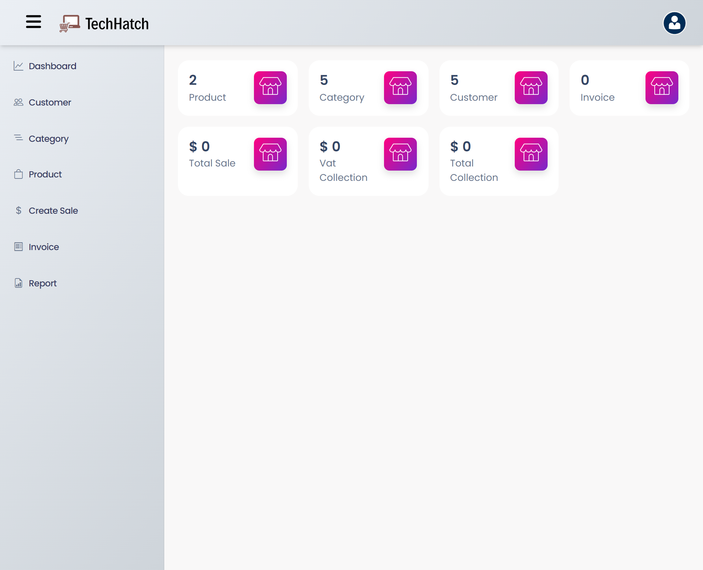
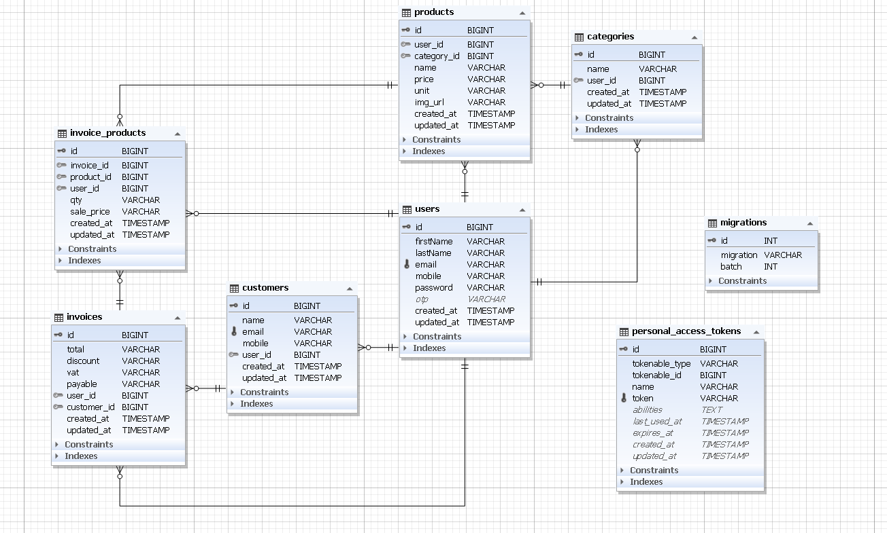

<!-- PROJECT LOGO -->
<br />
<div align="center">
  <a href="">
    
  </a>

<h2 align="center"> Point Of Sale Application</h2>

  <p align="center">TechHatch POS is a Point of Sale application designed to streamline transactions, 
and empower businesses of all sizes. With intuitive features, real-time analytics, 
and real-time inventory management, TechHatch POS is your trusted partner for efficient sales management and business growth </p>
   
    
  
 <a href="http://techhatch-pos.great-site.net">View Demo</a>
</div>


<!-- TABLE OF CONTENTS -->
<details>
  <summary>Table of Contents</summary>
  <ol>
    <li>
      <a href="#about-the-project">About The Project</a>
    </li>
    <li>
      <a href="#getting-started">Getting Started</a>
    </li>
    <li><a href="#product-requirement-and-roadmap">Product Requirement and Roadmap
</a></li>
    <li><a href="#database-design">Database Design</a></li>
    <li><a href="#contact">Contact</a></li>
    <li><a href="#acknowledgments">Acknowledgments</a></li>
  </ol>
</details>


<!-- ABOUT THE PROJECT -->
## About The Project



### Inventory Management
* Keep track of your stock levels in real-time.
* Our POS solution includes robust inventory management features,.
* Helping you optimize stock levels, reduce wastage, and enhance overall efficiency.

### POS System Integration
* Seamlessly integrate our state-of-the-art POS system into your business environment.
* From retail stores to restaurants, our solutions are adaptable and tailored to suit your industry.

### Customized Reporting and Analytics
* Gain valuable insights into your business performance with our comprehensive reporting and analytics tools.
* Monitor sales , track Customer, Products, Generate pdf report and make informed decisions for future growth.


<p align="right">(<a href="#readme-top">back to top</a>)</p>


### Built With

This section should list any major frameworks/libraries used to bootstrap your project. Leave any add-ons/plugins for the acknowledgements section. Here are a few examples.


* [![Laravel][Laravel.com]][Laravel-url]
* [![Bootstrap][Bootstrap.com]][Bootstrap-url]
* [![JQuery][JQuery.com]][JQuery-url]


<p align="right">(<a href="#readme-top">back to top</a>)</p>


<!-- GETTING STARTED -->
## Getting Started


### Prerequisites
* PHP 8.2.4+
* Composer (dependency manager for PHP)
* Database (MySQL/ PostgreSQL/ SQLite/ SQL Server)
* Git

### Installation

Please Follow the steps to install this project Locally.

#### 1. Clone the repo
Open your terminal and navigate to the directory where you want to install the Laravel project. 
Then run the following command:
   ```sh
   git clone https://github.com/Sabbir-Hossain12/POINT-OF-SALE-APPLICATION-by-Laravel.git
   ```
#### 2. Navigate to Project Directory
Move into the project directory:
   ```sh
   cd POINT-OF-SALE-APPLICATION-by-Laravel
   ```

#### 3. Install Dependencies
Once you are in the project directory, use Composer to install the required dependencies:
   ```sh
   composer install
   ```

#### 4. Create Environment File
Laravel requires an environment file for configuration. Duplicate the .env.example file and save it as .env:

   ```sh
   cp .env.example .env
   ```
#### 5. Generate Application Key
Run the following command to generate a unique application key:
   ```sh
php artisan key:generate
   ```
#### 6. Run Migrations
Use the following command to run database migrations:
   ```sh
  php artisan migrate
   ```   
#### 7. Serve the Application
You can use Laravel's built-in development server to run the application locally. 
Execute the following command:
```sh
php artisan serve
```   
This will start a development server, and you can access your Laravel application at http://127.0.0.1:8000 in your web browser.
<p align="right">(<a href="#readme-top">back to top</a>)</p>


<!-- ROADMAP -->
## Product Requirement and Roadmap

* Should have product category listing
* Should have product listing
* Sales & invoice features
* Business report features
* System should be multiuser, that many business can use it by creating profile.

### Phase 01: Developing User Auth Back-End Features
1. User registration (end point)
2. User login & issue JWT token (end point)
3. Sending OTP Code to Email - Password Recover Stage 01 (end point)
4. Verify OTP Code - Password Recover Stage 02 (end point)
5. Allow user to reset password - Password Recover Stage 03 (end point)
6. Allow user to get profile details (end point)
7. Allow user to update profile details (end point)

### Phase 02: Categories
1. Planning Product Category Table By Profile
2. Category Managing Back-End Development
3. Category Managing Front-End Development

### Phase 03: Customers
1. Planning Customer Table
2. Customer Managing Back-End Development
3. Customer Managing Front-End Development

### Phase 04: Products
1. Planning Product Table
2. Product Managing Back-End Development
3. Product Managing Front-End Development

### Phase 05: Invoice
1. Planning Invoice Table
2. Product Invoice Back-End Development
3. Product Invoice Front-End Development

### Phase 06: Dashboard & Report
1. Dashboard summary - Total customer, Product, Sales, Category.
2. Business Report - Date to Date sales report.

### Phase 07: Testing
1. Dashboard summary - Total customer, Product, Sales, Category.
2. Business Report - Date to Date sales report.

<p align="right">(<a href="#readme-top">back to top</a>)</p>

## Database Design




<!-- CONTACT -->
## Contact

Sabbir Hossain- h.sabbir36@yahoo.com

Project Link: https://github.com/Sabbir-Hossain12/POINT-OF-SALE-APPLICATION-by-Laravel.git

<p align="right">(<a href="#readme-top">back to top</a>)</p>


<!-- ACKNOWLEDGMENTS -->
## Acknowledgments

i would like to give credit to some of the resources down below that helped my project.

* [Font Awesome](https://fontawesome.com)
* [Bootstrap](https://getbootstrap.com/)
* [Data Table](https://datatables.net/)
* [DomPdf]()
* [Axios]()
* [Toastify JS]()


<p align="right">(<a href="#readme-top">back to top</a>)</p>


<!-- MARKDOWN LINKS & IMAGES -->
<!-- https://www.markdownguide.org/basic-syntax/#reference-style-links -->
[contributors-shield]: https://img.shields.io/github/contributors/othneildrew/Best-README-Template.svg?style=for-the-badge
[contributors-url]: https://github.com/othneildrew/Best-README-Template/graphs/contributors
[forks-shield]: https://img.shields.io/github/forks/othneildrew/Best-README-Template.svg?style=for-the-badge
[forks-url]: https://github.com/othneildrew/Best-README-Template/network/members
[stars-shield]: https://img.shields.io/github/stars/othneildrew/Best-README-Template.svg?style=for-the-badge
[stars-url]: https://github.com/othneildrew/Best-README-Template/stargazers
[issues-shield]: https://img.shields.io/github/issues/othneildrew/Best-README-Template.svg?style=for-the-badge
[issues-url]: https://github.com/othneildrew/Best-README-Template/issues
[license-shield]: https://img.shields.io/github/license/othneildrew/Best-README-Template.svg?style=for-the-badge
[license-url]: https://github.com/othneildrew/Best-README-Template/blob/master/LICENSE.txt
[linkedin-shield]: https://img.shields.io/badge/-LinkedIn-black.svg?style=for-the-badge&logo=linkedin&colorB=555
[linkedin-url]: https://linkedin.com/in/othneildrew
[product-screenshot]: images/screenshot.png
[Next.js]: https://img.shields.io/badge/next.js-000000?style=for-the-badge&logo=nextdotjs&logoColor=white
[Next-url]: https://nextjs.org/
[React.js]: https://img.shields.io/badge/React-20232A?style=for-the-badge&logo=react&logoColor=61DAFB
[React-url]: https://reactjs.org/
[Vue.js]: https://img.shields.io/badge/Vue.js-35495E?style=for-the-badge&logo=vuedotjs&logoColor=4FC08D
[Vue-url]: https://vuejs.org/
[Angular.io]: https://img.shields.io/badge/Angular-DD0031?style=for-the-badge&logo=angular&logoColor=white
[Angular-url]: https://angular.io/
[Svelte.dev]: https://img.shields.io/badge/Svelte-4A4A55?style=for-the-badge&logo=svelte&logoColor=FF3E00
[Svelte-url]: https://svelte.dev/
[Laravel.com]: https://img.shields.io/badge/Laravel-FF2D20?style=for-the-badge&logo=laravel&logoColor=white
[Laravel-url]: https://laravel.com
[Bootstrap.com]: https://img.shields.io/badge/Bootstrap-563D7C?style=for-the-badge&logo=bootstrap&logoColor=white
[Bootstrap-url]: https://getbootstrap.com
[JQuery.com]: https://img.shields.io/badge/jQuery-0769AD?style=for-the-badge&logo=jquery&logoColor=white
[JQuery-url]: https://jquery.com 
